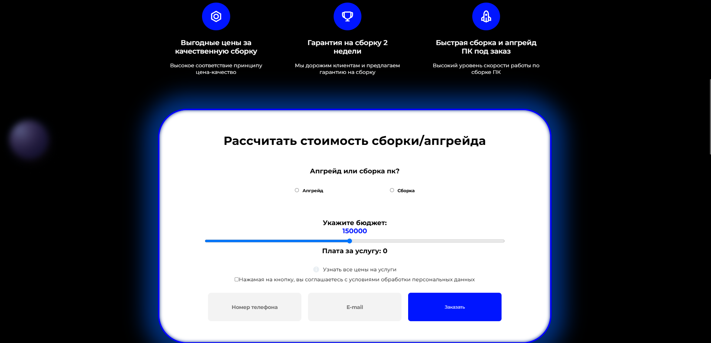
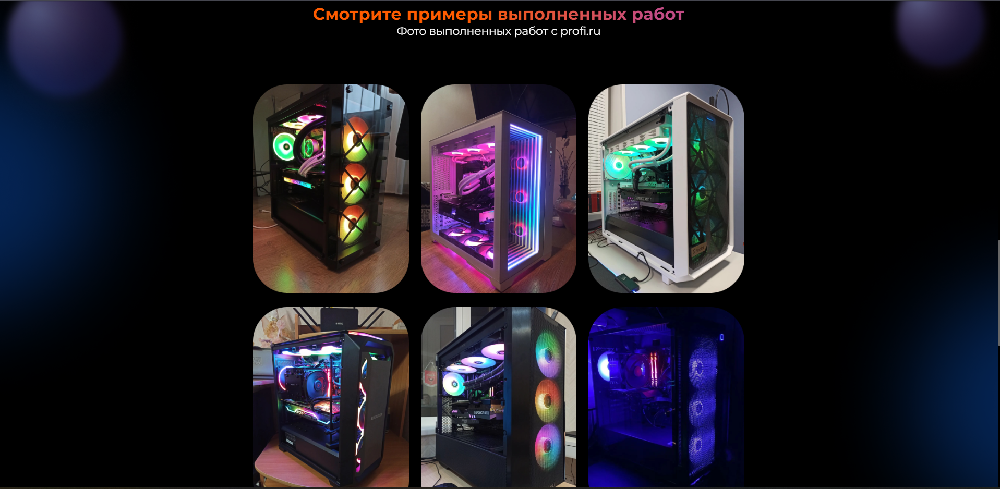

# 🖥️ PCRespect — Сайт-визитка услуг по сборке ПК ⚙️

**PCRespect** — это современный одностраничный сайт, рассказывающий о профессиональных услугах по сборке и подбору ПК под задачи клиента.  
Создан с любовью к производительности и стилю — **на React** 💻🚀


---

## 🌐 Демо

🔗 Онлайн: [pcrespect.netlify.app](https://pcrespect.netlify.app/)

---

## ✨ Особенности

- 🧰 **Услуги сборки** — описание всех этапов: от подбора до запуска  
- 🎯 **Чёткая структура** — удобная навигация по секциям  
- 📱 **Полная адаптивность** — идеально смотрится на телефонах, планшетах и ПК  
- 🧠 **Простой и понятный UI** — акцент на информацию и удобство  
- 💌 **Контактная форма** — для быстрой связи и оформления запроса
- 🤖 Для сайта был создан телеграмм бот,который отпаравляет владельцу уведомление при оставленной заявке от лица пользователя
---

## 🖼️ Скриншоты




## 🚀 Запуск проекта

```bash
# 1. Клонируй репозиторий
git clone https://github.com/Badadsher/pcrespect

# 2. Перейди в директорию
cd pcrespect

# 3. Установи зависимости
npm install

# 4. Запусти проект
npm run dev
```
